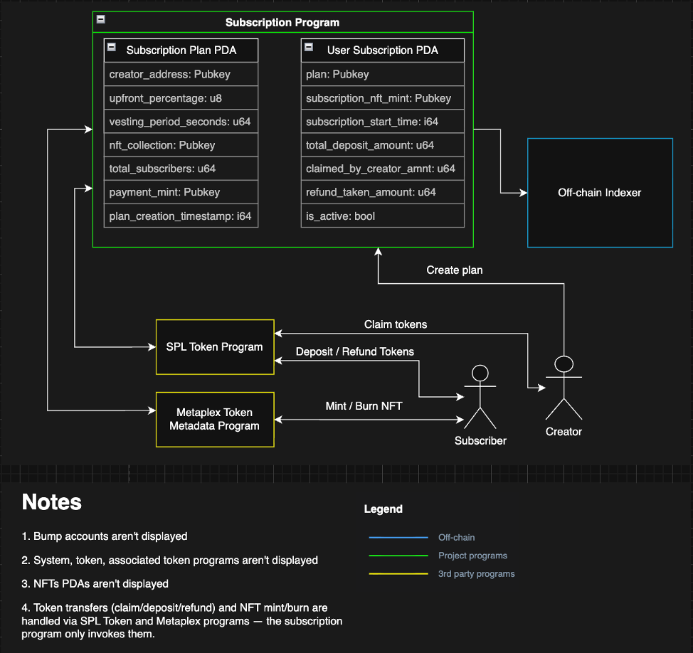
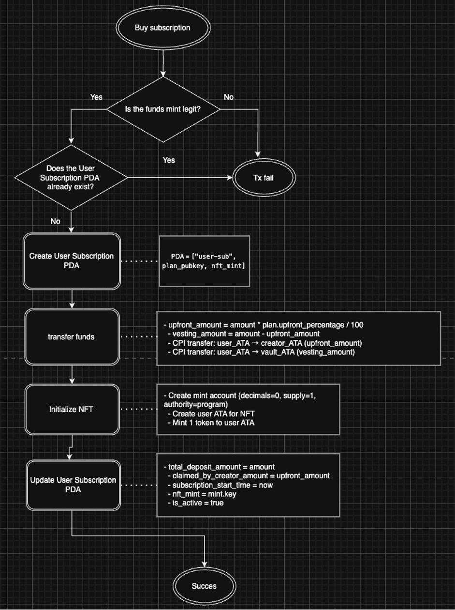
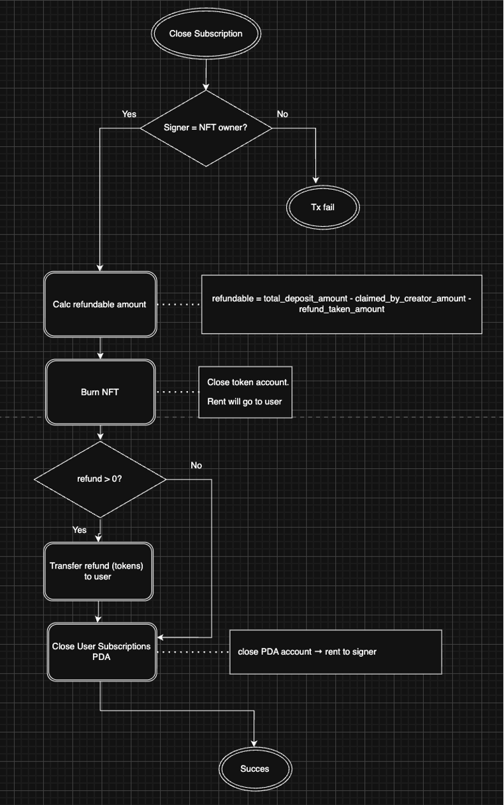
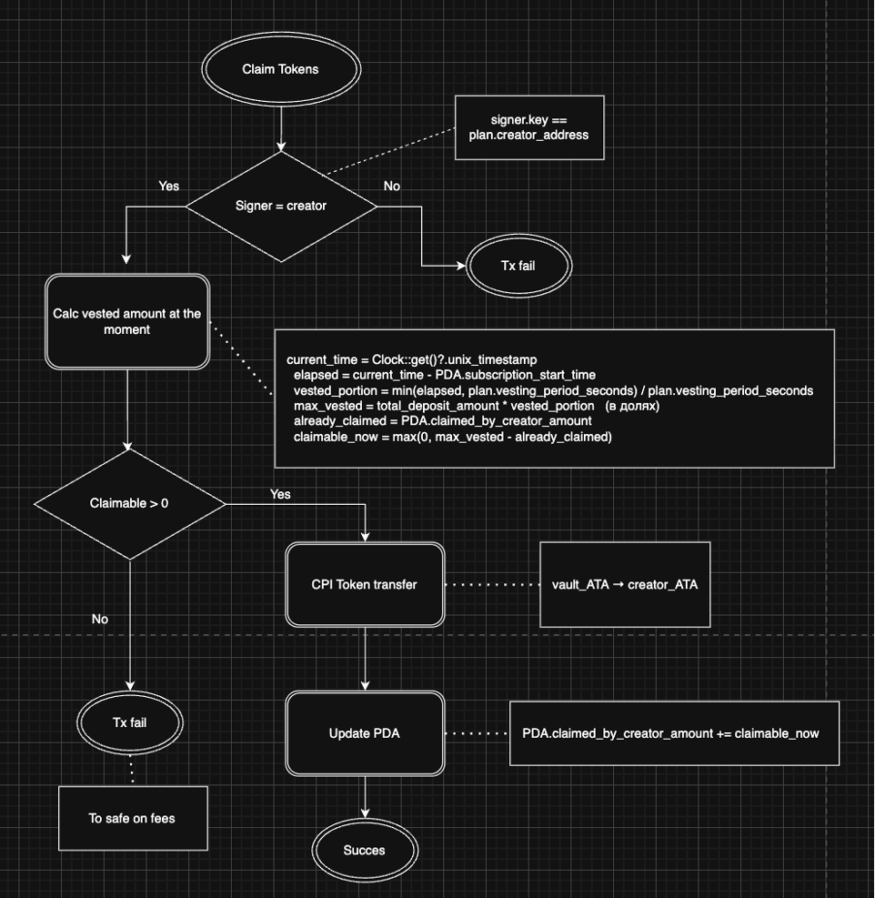
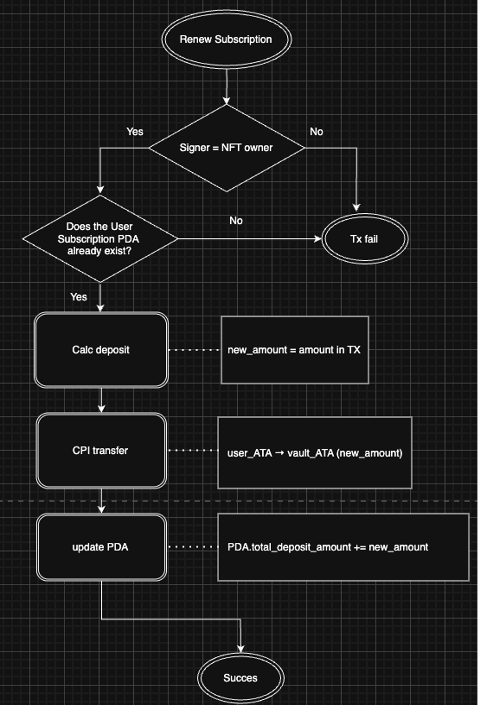

<p align="center">
  
  <br><br>
  <h1>Subscription NFT Protocol</h1>
  <h3>A Solana-based protocol for NFT-powered recurring subscriptions with vesting & instant refunds</h3>
</p>

<p align="center">
  <a href="https://solana.com">
    
  </a>
</p>

---

**Subscription NFT Protocol** enables creators to offer recurring subscription services natively on Solana using non-transferable NFTs.

Users deposit tokens → receive an NFT proving active subscription → creator gradually claims funds over time via linear vesting.

Subscribers can **burn** the NFT at any moment to instantly reclaim all unvested funds.

### ✨ Features

#### For Subscribers
- Mint subscription NFT + deposit tokens in **one transaction**
- Check current unvested / refundable balance
- Burn NFT → instant refund of unvested portion
- Renew or upgrade subscription by depositing more tokens (vested amount can roll over)

#### For Creators
- Deploy customizable subscription plans (upfront %, vesting duration, token, NFT metadata)
- Claim vested funds at any time
- Monitor active subscriptions and refunded users
- Gate content/services by verifying NFT ownership on-chain

### 🧠 How It Works

1. **Creator** deploys a Plan → creates Plan PDA + Vault token account
2. **User** buys subscription → tokens go to Vault, NFT is minted, UserSubscription PDA tracks deposit & vesting
3. **Creator** claims vested portion → protocol calculates vested amount and transfers tokens
4. **User** closes subscription → burns NFT → receives unvested tokens back → PDA closed/inactivated
5. **User** renews → adds more tokens to same vault & subscription record (NFT unchanged)

### 🏗 Architecture

| Account              | Description                                                                 |
|----------------------|-----------------------------------------------------------------------------|
| **Plan PDA**         | Stores plan config: vesting duration, upfront %, payment mint, NFT collection, vault address |
| **Vault**            | Token account holding all deposits for the plan (owned by program PDA)      |
| **UserSubscription PDA** | Per-user data: owner, total deposit, vesting start, claimed amount         |
| **Subscription NFT** | Non-transferable NFT from the plan’s collection — proves active subscription |

All token transfers and NFT mint/burn operations are done via CPI to **SPL Token** and **Metaplex** programs.

### 📜 Core Instructions

| Instruction            | Caller   | Description                                          |
|------------------------|----------|------------------------------------------------------|
| `create_plan`          | Creator  | Initialize plan + vault                              |
| `buy_subscription`     | User     | Deposit tokens → mint NFT → create subscription PDA  |
| `claim_tokens`         | Creator  | Withdraw vested portion from vault                   |
| `close_subscription`   | User     | Burn NFT → refund unvested tokens                    |
| `renew_subscription`   | User     | Add tokens to existing subscription                  |

### 🔒 Security Highlights

- NFT ownership checked on every refund / access operation
- All token & NFT actions via audited SPL + Metaplex programs
- Vault & subscription accounts only modifiable by authorized parties
- Burning NFT prevents reuse / double-spending

### PDA Derivation

```rust
// Plan PDA
seeds = [b"plan", creator_key.as_ref(), plan_id.as_ref()]

// UserSubscription PDA
seeds = [b"user_sub", plan_key.as_ref(), user_key.as_ref()]

// Vault PDA
seeds = [b"vault", plan_key.as_ref()]
```

## 🖼️ Architecture & Flow Diagrams

### 1. High-Level Architecture
This diagram illustrates the core Program Derived Addresses (PDAs) and the interaction with external SPL programs (Token and Metaplex).



*Image 1: Core protocol architecture — Plan PDA, User Subscription PDA, and interactions with SPL Token & Metaplex programs.*

---

### 2. Buy Subscription Flow
A detailed sequence of the `buy_subscription` instruction: validating the payment mint, creating the User Subscription PDA, splitting the payment into upfront and vesting portions, transferring funds, minting the NFT, and updating the PDA.



*Image 2: Complete flow for a user to purchase a subscription, including fund split, NFT minting, and PDA initialization.*

---

### 3. Close Subscription Flow
This diagram shows the `close_subscription` process: verifying NFT ownership, burning the NFT via Metaplex, calculating the refundable (unvested) amount, transferring funds back to the user, and deactivating the User Subscription PDA.



*Image 3: User burns NFT to receive unvested funds — ownership verification, burn, refund calculation, and account closure.*

---

### 4. Claim Tokens Flow (Creator)
The creator's `claim_tokens` instruction: calculating the vested amount based on the vesting schedule, transferring tokens from the vault to the creator's wallet, and updating the `claimed_by_creator_amount` in the User Subscription PDA.



*Image 4: Creator withdraws vested earnings — vesting calculation, fund transfer, and PDA update.*

---

### 5. Renew Subscription Flow
The `renew_subscription` flow: user deposits additional tokens, the protocol updates the `total_deposit_amount` in the existing User Subscription PDA, and optionally resets the vesting start time — all while keeping the same NFT.



*Image 5: User extends subscription by depositing more tokens — existing NFT remains, PDA is updated.*


